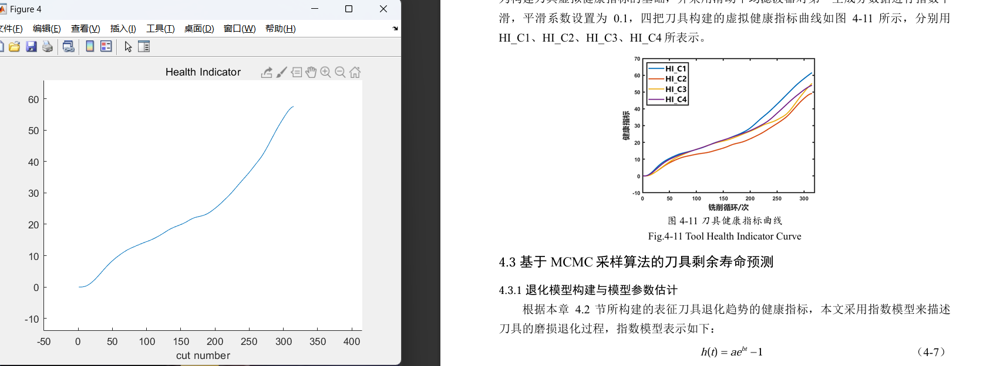
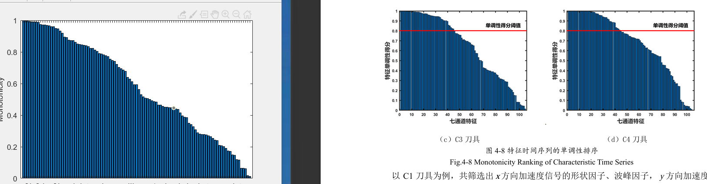
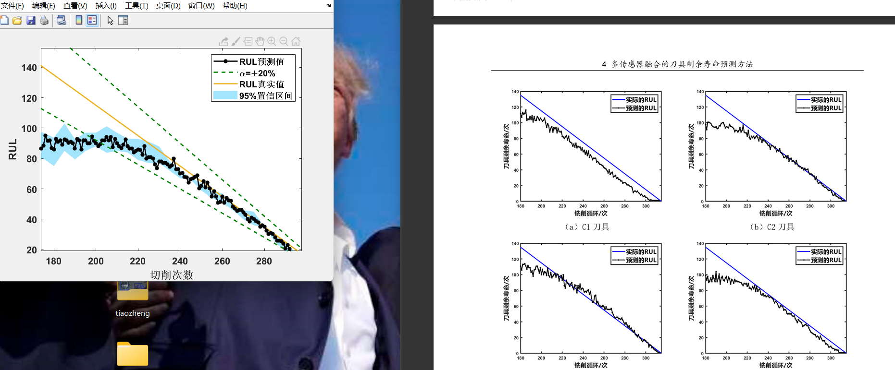
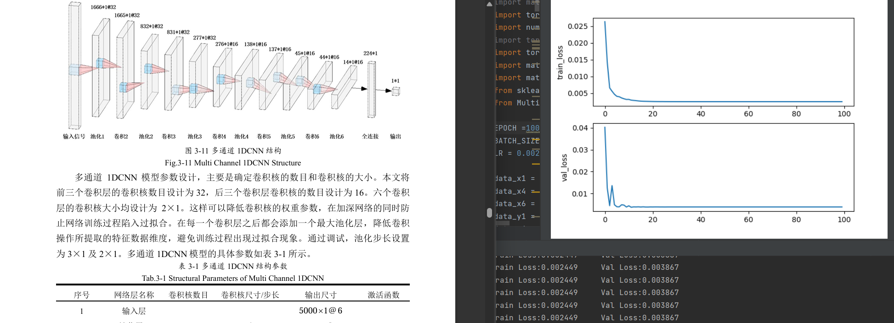
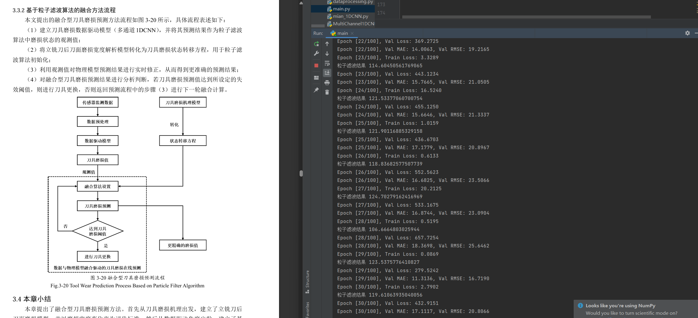

# 04-对PHM2010铣刀磨损数据进行分析

##### 技术支持+v: Ai1763591756获取完整的代码，可以提供相应的技术支持。

试验数据来源于美国纽约预测与健康管理学 会（ＰＨＭ）２０１０年高 速 数 控 机 床 刀 具 健 康 预 测 竞 赛的开放数据。实验条件如表格 所示 。

实验数据获取的形式是：   试验在上述切削条件下重复进行 ６ 次全寿命周期试验。端面铣削材料为正方形， 每次走刀端面铣的长度为 １０８ｍｍ 且 每 次 走 刀 时 间 相 等 ， 每次走刀后测量刀具的后刀面磨损量。试验监测数据有ｘ、ｙ 、 ｚ 三向铣削力信号 ， ｘ 、 ｙ 、 ｚ 三向铣削振动信号以及声发射均方根值。

##### 实验结果：

